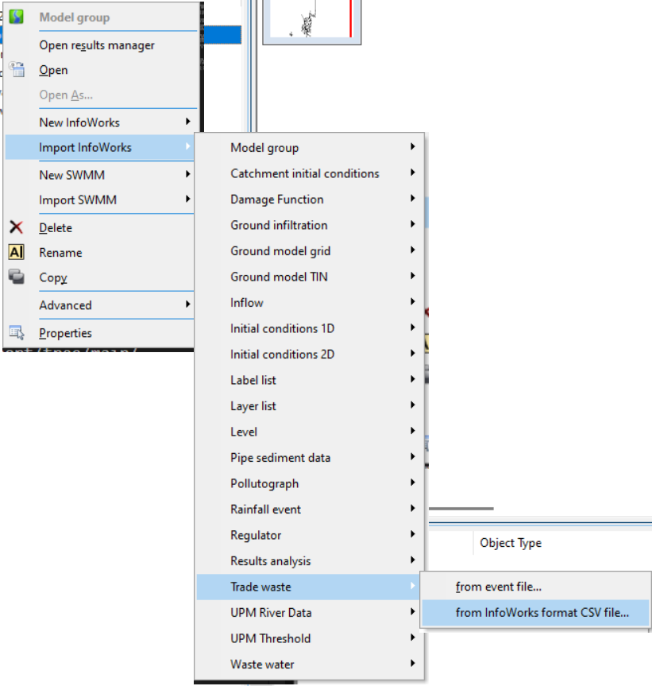
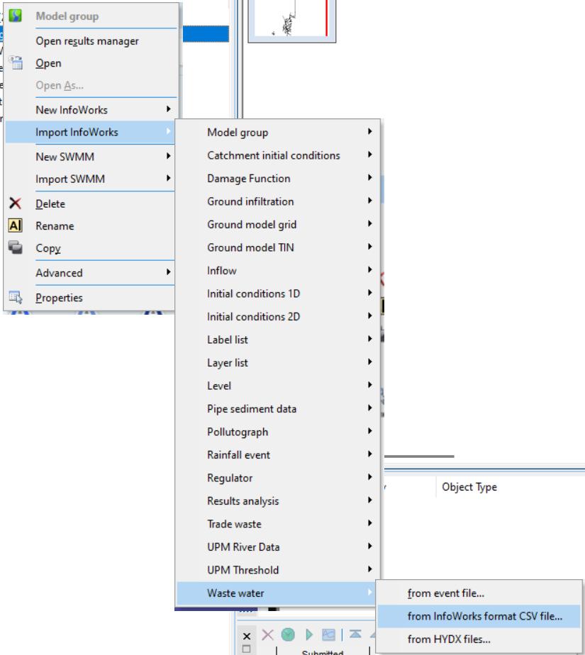

# Summary
This macro is a key tool in converting from InfoSewer or InfoSWMM to InfoWorks ICM. It automates the conversion of diurnal pattern data into a format that InfoWorks ICM can recognize and use.

The script starts by prompting the user to specify a file name and the input and output directories. Once these inputs are provided, the script processes a specific "PATNDATA.csv" file located in the input directory.

The processed data is then manipulated and structured appropriately, and subsequently pasted into either the "Trade waste" or "Waste water" sheet, depending upon which subroutine is being executed.

Finally, the manipulated data is saved as a new CSV file in the user-specified output directory. This automated process significantly simplifies and streamlines the data conversion task, making the transition from InfoSewer or InfoSWMM to InfoWorks ICM more efficient.

## Instructions
1. This macro requires the PATNDATA.dbf file to first be converted to CSV. If not already done, run the DBF_to_CSV macro, located here: https://github.com/innovyze/Open-Source-Support/tree/main/01%20InfoWorks%20ICM/01%20Ruby/01%20InfoWorks/0060%20-%20InfoSewer%20to%20InfoWorks%20ICM%20Conversion%20Tools/DBF%20to%20CSV%20Macro  

2. Open the Patterns_to_ICM_CSV macro (this macro). Run 'Convert Patterns to Trade waste' and/or 'Convert Patterns to Waste water' as needed, following the instructions provided in the macro file.

3. Import the generated CSV to InfoWorks model group as the appropriate event type:

## Assumptions
- The macro relies on pattern data following a standard format (hourly increments, 24 hours of data). The script will not work properly for patterns that do not follow this format.
- Calibration weekday, calibration weekend, and design profiles will all be populated with the same pattern.
- For trade waste event generation, the flow scaling factor is assumed to be 1.
- For waste water event generation, the per capita flow is assumed to be 0.