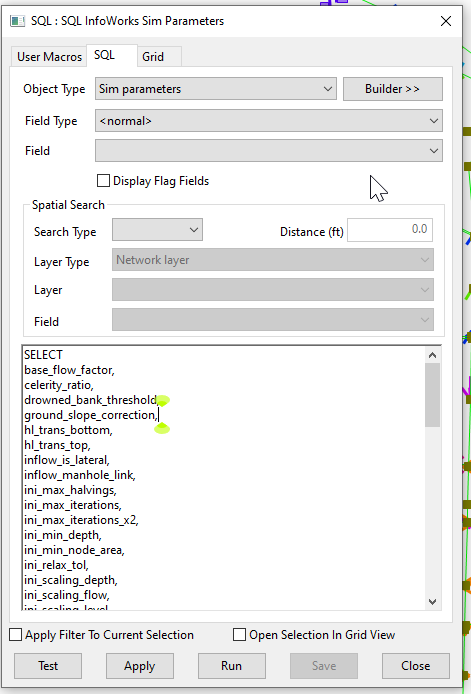

# Simulation Parameters Query for InfoWorks ICM

This SQL script queries various simulation parameters in an InfoWorks ICM model network.

## How it Works

The script selects the following simulation parameters:

1. `base_flow_factor`: The base flow factor for the simulation.
2. `celerity_ratio`: The celerity ratio for the simulation.
3. `drowned_bank_threshold`: The drowned bank threshold for the simulation.
4. `ground_slope_correction`: The ground slope correction for the simulation.
5. `hl_trans_bottom`: The bottom transition for head loss in the simulation.
6. `hl_trans_top`: The top transition for head loss in the simulation.
7. `inflow_is_lateral`: Whether inflow is considered lateral in the simulation.
8. `inflow_manhole_link`: The link for inflow manhole in the simulation.
9. `ini_max_halvings`: The maximum number of halvings for initialization in the simulation.
10. `ini_max_iterations`: The maximum number of iterations for initialization in the simulation.
11. `ini_max_iterations_x2`: The maximum number of iterations for initialization (times 2) in the simulation.
12. `ini_min_depth`: The minimum depth for initialization in the simulation.
13. `ini_min_node_area`: The minimum node area for initialization in the simulation.
14. `ini_relax_tol`: The relaxation tolerance for initialization in the simulation.
15. `ini_scaling_depth`: The scaling depth for initialization in the simulation.
16. `ini_scaling_flow`: The scaling flow for initialization in the simulation.
17. `ini_scaling_level`: The scaling level for initialization in the simulation.
18. `ini_scaling_volbal`: The scaling volume balance for initialization in the simulation.
19. `ini_time_weighting`: The time weighting for initialization in the simulation.
20. `ini_tolerance_depth`: The tolerance depth for initialization in the simulation.
21. `ini_tolerance_flow`: The tolerance flow for initialization in the simulation.
22. `ini_tolerance_volbal`: The tolerance volume balance for initialization in the simulation.
23. `lower_froude_number`: The lower Froude number for the simulation.
24. `max_space_step`: The maximum space step for the simulation.
25. `max_timestep`: The maximum timestep for the simulation.
26. `min_base_flow_depth`: The minimum base flow depth for the simulation.
27. `min_computational_nodes`: The minimum number of computational nodes for the simulation.
28. `min_slot_width`: The minimum slot width for the simulation.
29. `min_space_step`: The minimum space step for the simulation.
30. `otype`: The object type for the simulation.
31. `phase_in_time`: The phase-in time for the simulation.
32. `pressure_drop_inertia`: The pressure drop inertia for the simulation.
33. `sim_max_halvings`: The maximum number of halvings for the simulation.
34. `sim_max_iterations`: The maximum number of iterations for the simulation.
35. `sim_max_iterations_x2`: The maximum number of iterations (times 2) for the simulation.
36. `sim_min_depth`: The minimum depth for the simulation.
37. `sim_min_node_area`: The minimum node area for the simulation.
38. `sim_node_affects_infiltration`: Whether the node affects infiltration in the simulation.
39. `sim_relax_tol`: The relaxation tolerance for the simulation.
40. `sim_scaling_depth`: The scaling depth for the simulation.
41. `sim_scaling_flow`: The scaling flow for the simulation.
42. `sim_scaling_level`: The scaling level for the simulation.
43. `sim_scaling_volbal`: The scaling volume balance for the simulation.
44. `sim_time_weighting`: The time weighting for the simulation.
45. `sim_tolerance_depth`: The tolerance depth for the simulation.
46. `sim_tolerance_flow`: The tolerance flow for the simulation.
47. `sim_tolerance_level`: The tolerance level for the simulation.
48. `sim_tolerance_volbal`: The tolerance volume balance for the simulation.
49. `slope_base_flow_x2`: The slope base flow (times 2) for the simulation.
50. `start_timestep`: The start timestep for the simulation.
51. `stay_pressurised`: Whether the system stays pressurised in the simulation.
52. `steady_tol_depth`: The steady tolerance depth for the simulation.
53. `steady_tol_flow`: The steady tolerance flow for the simulation.
54. `swmm5_rdii`: The SWMM5 RDII for the simulation.
55. `upper_froude_number`: The upper Froude number for the simulation.
56. `use_2d_elevations`: Whether 2D elevations are used in the simulation.
57. `use_full_area_for_hl`: Whether the full area is used for head loss in the simulation.
58. `use_villemonte`: Whether Villemonte's method is used in the simulation.
59. `weight_by_n`: The weight by n for the simulation.
60. `width_multiplier`: The width multiplier for the simulation.

## Usage

To use this script, simply run it in the context of an open network in InfoWorks ICM. The script will automatically query the specified simulation parameters and return their values.

